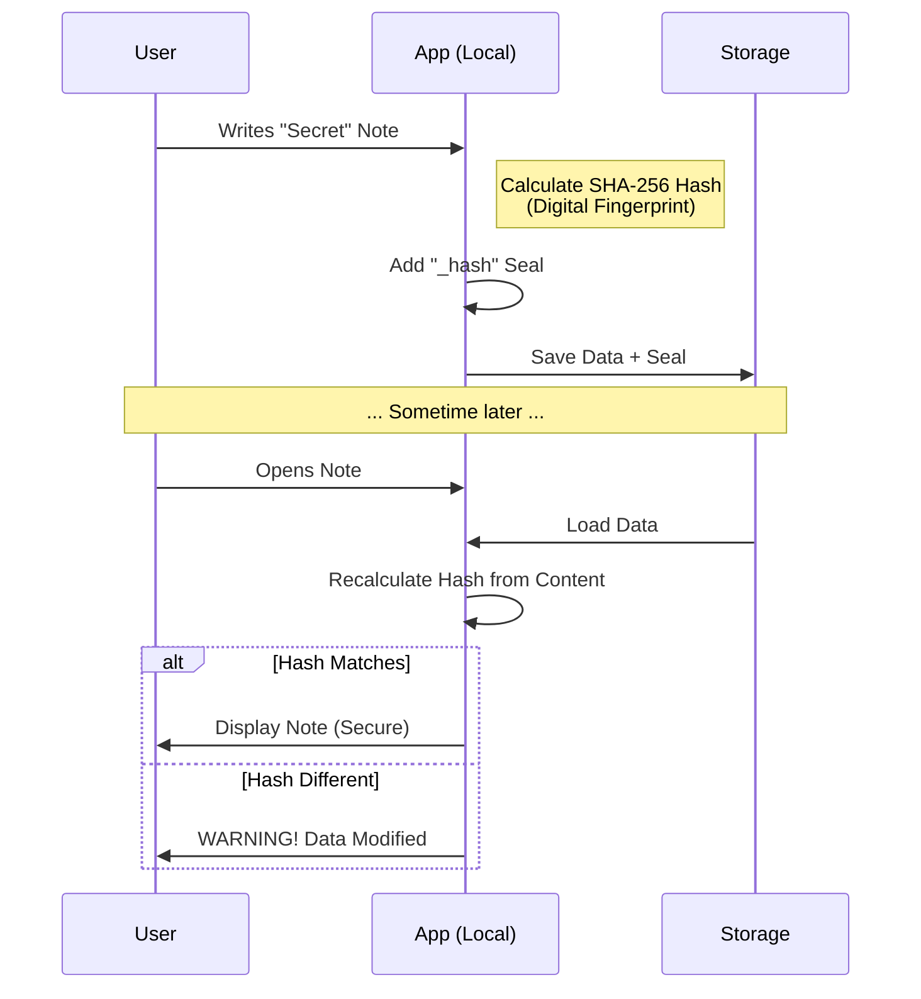
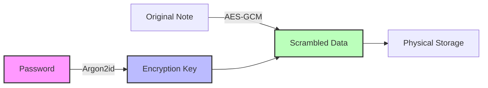

At Lembaranz, security is not just an add-on feature, but the core foundation. We apply the principles of **Zero-Knowledge** and **Cryptographic Integrity** inspired by blockchain technology.

## 1. Digital Seal (Data Integrity)

Every note you save is given a "Digital Seal" (SHA-256 Hash). It functions like a unique digital fingerprint for each content.

### How It Works

If even a single character changes without going through the application (e.g., manipulated by malware), the "Digital Seal" will be broken, and the application will detect the change.

## 2. Zero-Knowledge Encryption

We use the **Argon2id** algorithm (winner of the Password Hashing Competition) to transform your password into a very strong encryption key.

- **Keys in Memory Only**: Your password is never saved to disk or sent to a server.
- **Isolation**: Even we (the developers) cannot read your notes because we do not have the key.

## Code Transparency

This entire security logic is open-source and can be audited in the following files:
- `src/aksara/kunci.ts` (Encryption)
- `src/aksara/Integritas.ts` (Data Validation)
